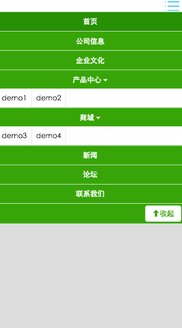
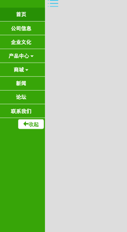
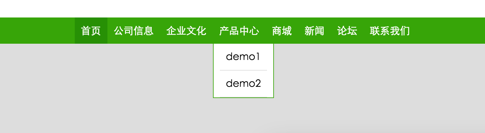

CSS 总结
========
我个人比较推崇用 Compass 来书写 CSS，所以该项目也会以 Compass 为基础搭建起来。

依旧在原生的 CSS HTML JavaScript 和 推崇缩进的理念上徘徊。

## CSS Reset

>
  由于早期的浏览器支持和理解的 CSS 规范不同，导致浏览器在渲染页面时效果不一致，出现很多兼容性问题。

  ```
    <link href="//cdn.bootcss.com/normalize/3.0.3/normalize.css" rel="stylesheet">
  ```

 * [Normalize](https://github.com/necolas/normalize.css/)


## HTML5 CSS3 兼容 IE


  ```
    <!--[if lt IE 9]>
      <script src="//cdn.bootcss.com/html5shiv/3.7.2/html5shiv.min.js"></script>
      <script src="//cdn.bootcss.com/respond.js/1.4.2/respond.min.js"></script>
      <script src="//cdn.bootcss.com/selectivizr/1.0.2/selectivizr-min.js"></script>
    <![endif]-->
  ```

  * [html5shiv -- 让 IE6-8 识别 HTML5 新的元素](https://github.com/aFarkas/html5shiv/tree/master/dist)
  * [Respond -- 让 IE6-8 支持 CSS3 Media Query](https://github.com/scottjehl/Respond/tree/master/dest)
  * [Selectivizr -- 让 IE6-8 支持 CSS3 伪类和属性选择器](https://github.com/keithclark/selectivizr)

## responsive  flexible design

<!-- ## nav-demo

  纯 CSS3 实现的 网页和手机端 自适应 menu



 -->

## 前端工具

  * [Viewport Sizes](http://viewportsizes.com/)
  * [HTML CSS JavaScript 美化](http://tool.lu/)

### compass 

```
sudo gem install sass 
sudo gem install compass
sudo gem install susy
sudo gem install breakpoint
```

```
gulp-compass 
gulp-sass
```


# 提高浏览器的渲染速度

  * 写出高效的 css 代码
  * 避免使用 css 表达式
  * 把 css 文件放在页面顶部
  * 指定页面图片的尺寸
  * 页面头部标明文档编码

浏览器解析html代码的过程：

  构建一个 DOM 树，
  加入页面要现实的元素，
  每当一个新元素加入到这个 DOM 树中，浏览器便会通过 css 引擎查遍 css 样式表，找到符合该元素的样式规则应用到这个元素上。(css 引擎查找样式表，对每条规则都 `按从右到左的顺序去匹配` )


## [写出高效的 css 代码](https://developer.mozilla.org/en-US/docs/Web/Guide/CSS/Writing_efficient_CSS)

  选择器的效率 从高到低
     * id选择器（#myid）
     * 类选择器（.myclassname）
     * 标签选择器（div,h1,p）
     * 相邻选择器（h1+p）
     * 子选择器（ul > li）
     * 后代选择器（li a）
     * 通配符选择器（*）
     * 属性选择器（a[rel="external"]）
     * 伪类选择器（a:hover,li:nth-child）

    
    `浏览器读取选择器的顺序是由右到左进行`
    `越具体的关键选择器，其性能越高`


  + 定义的 css 样式规则条数 越少越好, 删除不必要的样式定义。
  + 优化每条规则的选择符书写方式， 尽量让 css 引擎一看就知道规则是需要应用到当前这个元素上。


      避免使用通配符(避免普遍规则)
      多用 id 或 class 选择符(尽可能使用具体的类别)
      不要画蛇添足(不要在ID选择器前加标签名或类名) 如：form#UserLogin 
      避免使用后代选择符,去掉不必要的祖先元素, 用 class 代替 如：ul li -> .li-class
      避免给非链接标签添加 :hover 伪类选择器
 

## 把css文件放在页面顶部

  浏览器只有在所有样式表下载完成后才会继续下载页面其他内容。
  内联样式表（放在style内的样式）有可能会引起页面重新渲染或显示隐藏页面中的某些元素，建议不要使用内联样式表。

## 指定页面图片的尺寸

  指定页面图片尺寸，要符合图片的真实尺寸（不要通过指定尺寸来缩放图片），可以避免尺寸改变导致的页面结构效果的变化，所以对加快页面渲染速度有益。

  建议不要使用内联样式表

# css 表达式

# css 命名规范

## 命名规则说明

```
  1）所有的命名最好都小写
  2）属性的值一定要用双引号("")括起来，且一定要有值如class="divcss5",id="divcss5"
  3）每个标签都要有开始和结束，且要有正确的层次，排版有规律工整
  4）空元素要有结束的tag或于开始的tag后加上"/"
  5）表现与结构完全分离，代码中不涉及任何的表现元素，如style、font、bgColor、border等
  6）h1 到 h5 的定义，应遵循从大到小的原则，体现文档的结构，并有利于搜索引擎的查询。
  7）给每一个表格和表单加上一个唯一的、结构标记id
  8）给图片加上alt标签
  9）尽量使用英文命名原则
  10）尽量不缩写，除非一看就明白的单词
```

## 相对网页外层重要部分CSS样式命名

### CSS文件命名 

```
  master.css,style.css  主要的
  module.css  模块
  base.css  基本共用
  layout.css  布局，版面
  themes.css  主题
  columns.css 专栏
  font.css  文字、字体
  forms.css 表单
  mend.css  补丁
  print.css 打印
```

### 网页公共命名

```
  #wrapper  页面外围控制整体布局宽度
  #container或#content 容器,用于最外层
  #layout 布局
  #head, #header  页头部分
  #foot, #footer  页脚部分
  #nav  主导航
  #subnav 二级导航
  #menu 菜单
  #submenu  子菜单
  #sideBar  侧栏
  #sidebar-a, #sidebar-b  左边栏或右边栏
  #main 页面主体
  #tag  标签
  #msg #message 提示信息
  #tips 小技巧
  #vote 投票
  #friend-link 友情连接
  #title  标题
  #summary  摘要
  #loginbar 登录条
  #search-input  搜索输入框
  #hot  热门热点
  #search 搜索
  #search-output  搜索输出和搜索结果相似
  #search-bar  搜索条
  #search-results 搜索结果
  #copyright  版权信息
  #branding 商标
  #logo 网站LOGO标志
  #siteinfo 网站信息
  #siteinfo-legal  法律声明
  #siteinfo-credits  信誉
  #joinus 加入我们
  #partner  合作伙伴
  #service  服务
  #regsiter 注册
  #arrow 箭头
  #guild  指南
  #sitemap  网站地图
  #list 列表
  #homepage 首页
  #subpage  二级页面子页面
  #tool, #toolbar 工具条
  #drop 下拉
  #dorpmenu 下拉菜单
  #status 状态
  #scroll 滚动
  .tab  标签页
  .left .right .center  居左、中、右
  .news 新闻
  .download 下载
  .banner 广告条(顶部广告条)
```

### 电子贸易相关

```
  .products 产品
  .products_prices  产品价格
  .products_description 产品描述
  .products_review  产品评论
  .editor_review  编辑评论
  .news_release 最新产品
  .publisher  生产商
  .screenshot 缩略图
  .faqs 常见问题
  .keyword  关键词
  .blog 博客
  .forum  论坛
```


[grayscale](http://james.padolsey.com/demos/grayscale/grayscale.js)